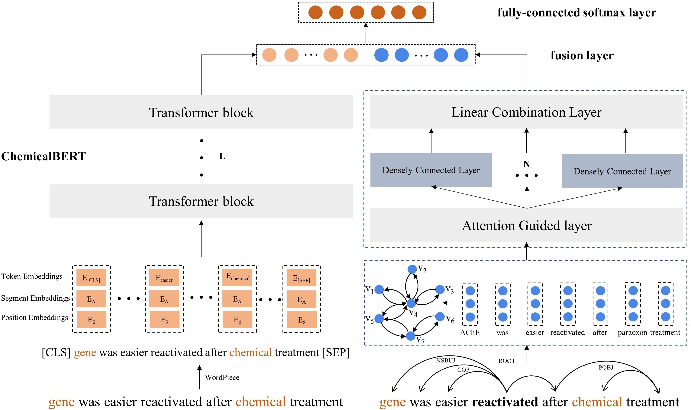

Chemical-protein Interaction Extraction via ChemicalBERT and Attention Guided Graph Convolutional Networks in Parallel
==========
The model consists of ChemicalBERT and Attention Guided Graph Convolutional Networks (AGGCN) two parallel components. We pre-train BERT on large-scale chemical interaction corpora and re-define it as ChemicalBERT to generate high-quality contextual representation, and employ AGGCN to capture syntactic graph information of the sentence. Finally, the contextual representation and syntactic graph representation are merged into a fusion layer and then fed into the fully-connected softmax layer to extract CPIs.

[ (https://ieeebibm.org/BIBM2020/BIBM%202020%20Accepted%20Paper%20list.docx)

Conference: December 16-19, 2020
The Program can be found on the [Conference Website](https://ieeebibm.org/BIBM2020/) by clicking Program on the left hand menu.

The Program can be found on the [The paper has been accepted by 2020 IEEE International Conference on Bioinformatics and Biomedicine (IEEE BIBM 2020).](https://ieeebibm.org/BIBM2020/BIBM%202020%20Accepted%20Paper%20list.docx) by clicking Program on the left hand menu.


See below for an overview of the model architecture:



  

## Requirements

- Python 3 (tested on 3.6.10)

- PyTorch (tested on 1.3.1)

- CUDA (tested on 10.1.243)

- pytorch_pretrained_bert (tested on 0.6.1)

- botocore (tested on 1.12.189)

- tensorflow (tested on 1.15.0)

- boto3 (tested on 1.9.162)

- requests (tested on 2.22.0)

- numpy (tested on 1.19.1)

- tqdm (tested on 4.42.1)

## Download Resources
+ [Model config and model weights](https://drive.google.com/file/d/1PHMcongiYZzy0d8J5pbiy_4RkYWuIWmd/view?usp=sharing)

## Evaluation
we have conducted experiments on the ChemProt corpus and DDIExtraction 2013 corpus

Testing on CPI extraction
```
python3 eval_cpi.py
```

Testing on DDI extraction.
Before run it, please modify the configuration information under /utils/constant.py

```
python3 eval_ddi.py
```
